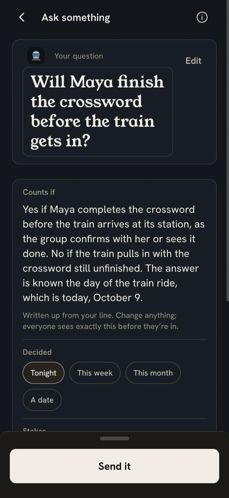
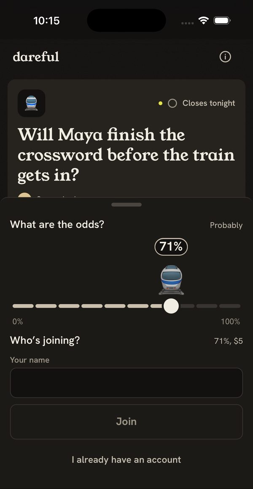
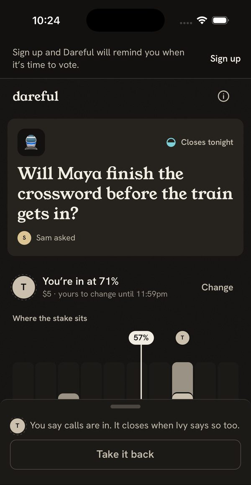
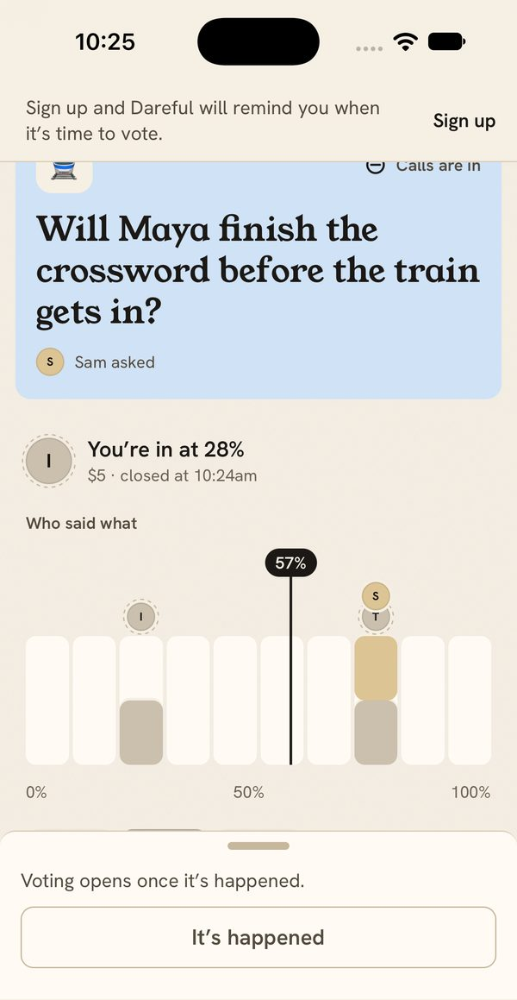
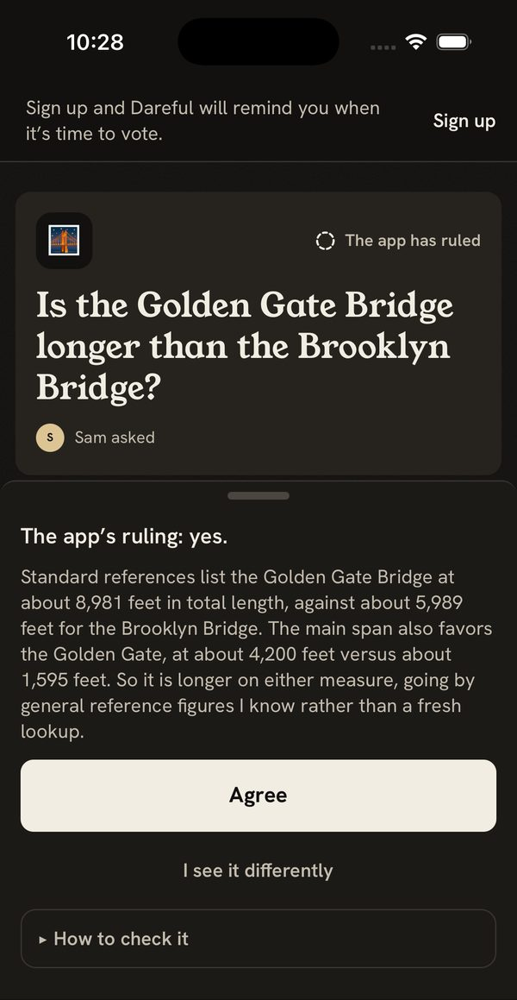
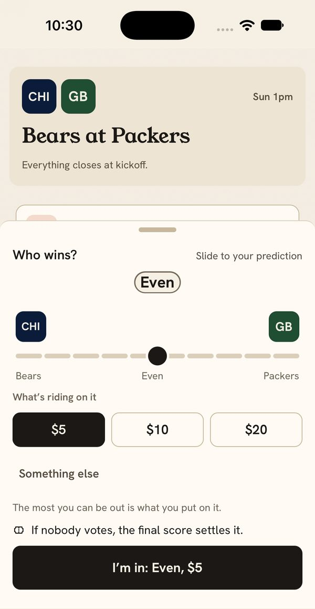
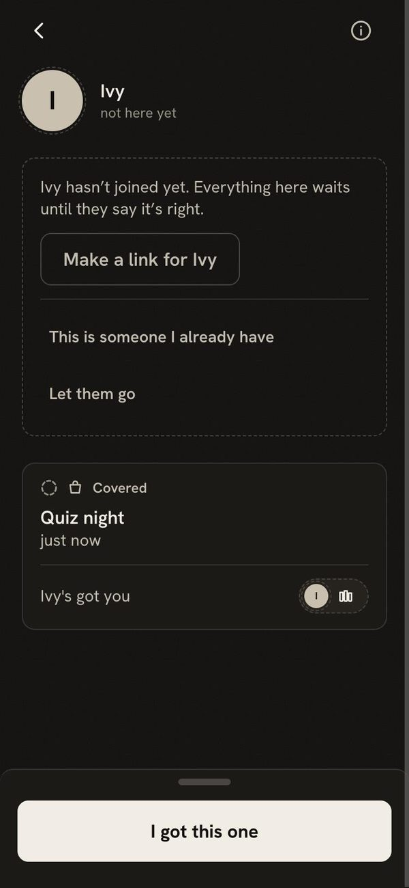
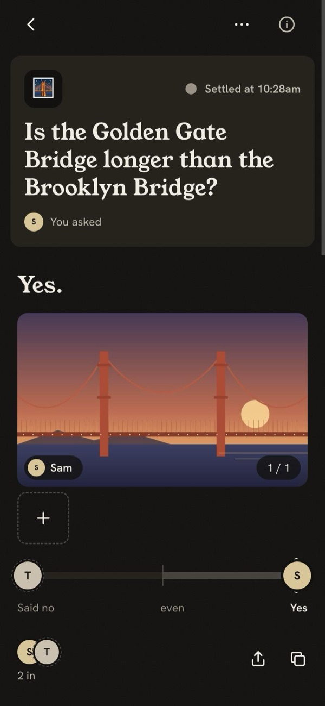

# Dareful

Dareful settles the small bets a friend group already makes: someone asks a question, everyone puts a number on it, and the people in it decide what happened. Each person is scored on how close they came, and what that leaves between friends goes into a ledger of records on Monad that nobody can move or sell, signed by the people it binds, with no money held anywhere.

Live at [dareful.app](https://dareful.app) · [The demo, in two minutes](VIDEO_DEMO_LINK) · [How it's built](VIDEO_BUILD_LINK)

## Try it yourself

A question with a guest in it is settled off the chain, so this path uses two accounts. The second account's sign-in is in the submission form, and never in this repository.

1. On a phone or a desktop browser, open [dareful.app](https://dareful.app), tap “Get started”, then “Continue with Google”.
2. Tap “Ask something” and type a question, for example “Will it rain before 6pm?”. Keep “Yes or no” and “Quick setup”, tap “Set the terms”, read the terms the app wrote, pick when it's decided and the stakes, and tap “Send it”.
3. Tap “Copy the link” (the icons at the end of the row of who's in) and open the link in a private window. Slide to a prediction, tap “I'm in at”, then “I already have an account”, and sign in with the account from the submission form; the call goes in as that account.
4. Back on the first account, make your own call: slide to a different prediction and tap “I'm in at”.
5. Close it: as the asker, tap “Close it with 2”, then “Close it now”.
6. See who said what: once it's closed, every call shows under “Who said what”, with whose it is.
7. Settle it: tap “It's happened”, pick what happened, tap “Say it”, and confirm in the sheet. Do the same from the other account. When the two agree it's settled: closest first, and who's got who.
8. Find it on the explorer: open [the Dares contract](https://testnet.monadexplorer.com/address/0xd621c7770B96d2bF94638a28A15B3636cC0a3Fa0). Its newest transactions are your question's `create`, carrying both signed entries, and its `resolve`, carrying both votes, each sent by the app's relayer. The record of what one of you owes the other is minted on [the Ledger contract](https://testnet.monadexplorer.com/address/0x8E200d344fA233d85b78f85aC78c3F778397F26D) inside the `resolve` transaction.

To join as a guest instead, open the question's link in a private window, slide to a number, tap “I'm in at”, type a name, and tap “Join as”. A name is all it takes. A question with a guest in it is decided and settled off the chain, and what it leaves waits until the guest makes an account and confirms it.

## What it looks like

<table>
  <tr>
    <td width="25%"></td>
    <td width="25%"></td>
    <td width="25%"></td>
    <td width="25%"></td>
  </tr>
  <tr>
    <td>Asking: the terms the app wrote from one line.</td>
    <td>Joining from a link: a number and a name.</td>
    <td>Calls are in: it closes when enough of the people in say so.</td>
    <td>The reveal: every call, and whose it is, once it's closed.</td>
  </tr>
  <tr>
    <td></td>
    <td></td>
    <td></td>
    <td></td>
  </tr>
  <tr>
    <td>An argument: the app's ruling, sealed at the ask, shown at the close with Agree.</td>
    <td>A game page: who wins, before kickoff.</td>
    <td>A person's page: a round covered for a friend who joined as a guest.</td>
    <td>Settled, with a photo from that night.</td>
  </tr>
</table>

The screenshots are from the iOS 26 and iOS 27 simulators and a development browser, on walk data with made-up names.

## Traction

The picture above is drawn by the app as it runs, at [dareful.app/numbers](https://dareful.app/numbers), so it keeps counting through judging. It reads the database and the indexer at most once every five minutes and says when it last did. The numbers are the owner's stats page's own, with every test account left out, counted since launch (midnight Eastern, September 13, 2026):

- People with an account: accounts made since launch.
- Guests: people who joined a question with a name and no account, on a question a counted person asked. A guest who later made an account counts as that account.
- Questions asked: questions sent by counted people, from the ledger's own table.
- Questions settled: the ones that ended in a decision, by the vote of the people in, the tiebreaker, the final score or the app's ruling standing, "nobody can tell" included. A question called off or expired is not settled.
- On Monad, from real use: the obligations with a counted person on either side, the questions on the chain with a counted person in them, the counted people registered on the chain, and the sets they're registered in.

The test suites run against the live testnet contracts, so most of the contracts' transactions are tests. On October 9, 2026, after the full mutation audit, real use was 2.3% of the transactions that had gone through (52 of 2,309), read from the indexer's events and whose wallets they name ([`scripts/ops/chain-tests.ts`](scripts/ops/chain-tests.ts)). Every chain number in this README counts real use only. A question with a guest in it is decided and settled off the chain, so it isn't in the chain's counts.

## How it works

Next.js 16 (App Router, React 19) on Vercel at dareful.app; Postgres on Supabase through Drizzle; two Solidity contracts on Monad testnet (Foundry, OpenZeppelin 5's ERC-1155); Envio HyperIndex, the only thing that reads the chain; Dynamic for sign-in and two embedded wallets per person; Anthropic's models for writing terms and weighing outcomes; Web Push and email (Resend) for notifications; and one scheduler, a once-a-minute call to `/api/tick`.

The rule that splits the two halves: anything two people must agree on goes on the chain, and anything one person controls stays off it. Nobody holds a key that can move value, and the records can't be transferred, sold or redeemed; the contract refuses every transfer.

What goes on the chain, and why:

- Signed entries. A call is an EIP-712 message signed by its owner's ledger wallet over exactly the numbers they sent. At the close, one `create` carries the question's terms hash and every signed entry, and they land together or not at all.
- Each question's own voters. The contract reads the quorum from the governance wallets of exactly the people in: the question goes in its set's group when that group is exactly them, and otherwise in a group of its own registered at the close. Nobody outside a question can vote on it.
- Resolutions. A vote is a signature from the voter's governance wallet, which the server never holds, so the server can write the ledger but can never cast a vote; `resolve` checks a majority of the people in. When they don't decide, `arbitrate` records the tiebreaker's ruling, the final score or the app's ruling standing, with the ruling's hash, and `expire` ends a question nobody called, minting nothing.
- Obligations. Each person is scored (Brier for yes or no, the miss over the scale for a number, all or nothing for pick one), and the lower scorer pays the higher, pair by pair, never more than their stake. Each payment is a non-transferable ERC-1155 record (`mintFromDare`), carrying the app's own id for the row it mirrors. A cover ("I got this one") is minted when the person who owes it confirms it (`confirm`); settling and calling it even (`close`) and cancelling out (`net`) burn them.
- The sealed ruling. When an argument is asked and facts can settle it, the app rules at once and seals the ruling: the seal is keccak-256 of a random 32-byte salt followed by the ruling's text, and it ends the terms everyone signs. The terms' hash goes on the chain in `create`, so the ruling is fixed before anyone calls. At the close the app shows the text and the salt under “How to check it”: hash the salt followed by the text with keccak-256 and you get the seal in the terms, and hash the terms and you get the `termsHash` in the question's `DareCreated` event.

| Contract (Monad testnet, chain 10143) | Address |
| --- | --- |
| DarefulLedger: the records, sets, members and units | [0x8E200d344fA233d85b78f85aC78c3F778397F26D](https://testnet.monadexplorer.com/address/0x8E200d344fA233d85b78f85aC78c3F778397F26D) |
| DarefulDares: questions, entries, votes, scores | [0xd621c7770B96d2bF94638a28A15B3636cC0a3Fa0](https://testnet.monadexplorer.com/address/0xd621c7770B96d2bF94638a28A15B3636cC0a3Fa0) |
| The relayer, which pays gas and holds nothing else | [0x4534C3f805F1cc483C0b0193F754C16E0d2cdaA7](https://testnet.monadexplorer.com/address/0x4534C3f805F1cc483C0b0193F754C16E0d2cdaA7) |

One transaction from real use for each kind of event (from [`scripts/ops/real-use-txs.ts`](scripts/ops/real-use-txs.ts); a test's transaction never stands in for one):

| Event | Real use |
| --- | --- |
| A question created with its signed entries (`DareCreated`, `Entered`) | [October 9](https://testnet.monadexplorer.com/tx/0x36e7c05906882392a30a35b220d7598d6c763b00d13fcf1dae918a17d889dc2a) |
| A set registered (`GroupCreated`) | [October 9](https://testnet.monadexplorer.com/tx/0x16d5a6ada77e2062bc3781ef48535c053f74cb0d86adce34bc928f779c6b195a) |
| A unit registered (`DenomCreated`) | [October 9](https://testnet.monadexplorer.com/tx/0xe755e4c77bf380dcaa0dcdee1e92998ad71f84cadfd394506fbfaebc32c4bf0c) |
| Decided by the vote of the people in (`DareResolved`) | [September 26](https://testnet.monadexplorer.com/tx/0x903db4d37f4876cb8491410069ceaeface2b48081ba385dac12fbd02add180f5) |
| Decided by `arbitrate`, with each score and the records it minted (`DareArbitrated`, `Scored`, `mintFromDare`) | [September 28](https://testnet.monadexplorer.com/tx/0x0f1add16cc1a5510ca9bb3f9a9ebe75b86301c6e8d540627bc0000b2b7c41ef4) |
| Voided by `arbitrate` | [October 4](https://testnet.monadexplorer.com/tx/0x2623889754eb5a792042e6dc78d3520d57df2ea9a382b2b6f9bdf69e41f89cb3) |
| A record confirmed by the person who owes it (`confirm`) | [October 8](https://testnet.monadexplorer.com/tx/0xe04a5e06afcb3b3a2d716d6f647b9f7722e8b3c788b337444aadb9a833a154f2) |

Real use has none yet of a person added to an existing set, a void by vote, an expiry, settling or calling it even, cancelling out, or a sealed ruling (the one argument real use has on the chain was asked before rulings were sealed).

## Sponsors

### Dynamic

Every person gets two Dynamic embedded wallets on Monad, made without a word about wallets at their first sign-in (Google, email or phone, in the app's own sheet): a ledger wallet, which signs what binds only its owner (their calls, confirming what they owe, closing what they're owed), and a governance wallet, which signs one thing, a vote, and always asks. Pass the phone, where a friend makes their call on your phone with their own PIN, delegates the ledger wallet alone through Dynamic's delegated access; the governance wallet is refused by address in the signer, by a database trigger, and marked denied at Dynamic when the account is made. Monad is registered in code ([`src/lib/dynamic/networks.ts`](src/lib/dynamic/networks.ts), [`src/components/providers.tsx`](src/components/providers.tsx)); the sheet and the wallets' creation are in [`src/components/auth/`](src/components/auth); wallets are counted from the login token on the server ([`src/lib/auth/login.ts`](src/lib/auth/login.ts)); delegated signing is [`src/lib/chain/delegated-signer.ts`](src/lib/chain/delegated-signer.ts), with its webhook at [`src/app/api/delegation/route.ts`](src/app/api/delegation/route.ts) and pass the phone in [`src/lib/ledger/pass-the-phone.ts`](src/lib/ledger/pass-the-phone.ts) and [`src/lib/ledger/hand-over.ts`](src/lib/ledger/hand-over.ts).

### Envio

HyperIndex is the only thing that reads the chain. It indexes both contracts' events into the records (with what remains open on each), sets, members, units, questions and entries, plus one entity per event, and serves a person's open records, the chain's counts and the transactions above. It syncs through HyperSync and runs on Envio Cloud; on October 9 it was up and four blocks behind the chain's head. The indexer is [`indexer/`](indexer) (its config, schema and handlers); the app's queries, each checked with Zod, are [`src/lib/ledger/envio.ts`](src/lib/ledger/envio.ts); and [`scripts/verify-envio.ts`](scripts/verify-envio.ts) recomputes every question's payments from the scoring rule and checks them against the indexer.

### Alchemy

Alchemy's Monad testnet RPC is what the relayer sends through. Every contract call is a message signed by a person's wallet and submitted by one relayer that pays gas, with an explicit gas limit for each function, since Monad charges the declared limit. Its free tier allows `eth_getLogs` over ten blocks at a time, which is why Envio and not the app reads the chain. The key is server-only and is cut out of every error the app logs, stores or shows. See [`src/lib/chain/relayer.ts`](src/lib/chain/relayer.ts), [`src/lib/chain/gas.ts`](src/lib/chain/gas.ts) and [`src/lib/redact.ts`](src/lib/redact.ts).

## The AI

- Haiku 5.5 drafts: it writes a question's terms from one line (its type, the date it's decided by, the outcomes in the question's own words, a mark if none was picked), and asks the questions under Help define the terms.
- Sonnet 5.5 weighs: it decides whether facts can settle an argument (and declines a matter of taste or one between two people, offering to make it a dare), rules on it at the ask, proposes an outcome from what people said happened, writes Help define's final terms, and answers again for any draft that fails its shape or runs out of time.
- Opus 5.5 is the tiebreaker: it rules only when the people in a question don't decide it and they agreed to a tiebreaker when they entered, and it voids unless what's in front of it clearly supports one outcome.

Every call is in [`src/lib/ai/`](src/lib/ai) behind a typed function, its answer checked with Zod, with a plain fallback, so a model is never on the critical path: it proposes, the asker approves the terms, and the people in decide. A draft that fails is asked once of Sonnet and counted. No test or audit can reach the live API.

What a question costs, measured on October 9 by replaying every question counted people have written (26) on the models in use, at list prices ([`scripts/dev/compare-models.ts --part=current`](scripts/dev/compare-models.ts)): $0.0004 for a question's terms on average ($0.0005 at most), and $0.017 for an argument (the terms, the check at $0.005 and the sealed ruling at $0.011). The tiebreaker, when it runs, cost $0.010 to $0.013 a ruling on Opus 5.5 (every past ruling replayed on October 6). An outcome proposal measured about $0.004 on Sonnet 5.5 on October 4; no counted question has had anyone say what happened yet. Help define the terms with a web search adds 2 to 11 cents (measured October 8).

## Quality

- The suites run against the real database and the live testnet contracts: 513 unit tests, 231 database tests and 126 tests against the running server (one of them only against a deployed app), 870 in all, every one passing on October 9. Their rows are made for a run and removed after it, and their accounts are left out of every count.
- Every test has a mutant, but the one that runs only against a deployed app: a change to the code that breaks the rule the test names, which the test has to catch. The full audit runs each one alone against the live database and contract.
- Every round was walked by hand and recorded with what broke and what changed in [`docs/testing.md`](docs/testing.md), 43 sessions in all: on the owner's phones and in signed-in development browsers, and from the QA round on also on the iOS 26 and iOS 27 simulators, in Safari, private tabs and installed copies. The checks that need a real phone are listed and numbered there.

| Audit | Date | Mutants | Result |
| --- | --- | --- | --- |
| Full, the submission round | October 9 | 1,682: 997 unit, 427 database, 258 http | 1,679 killed on the run. Three survived and twelve kills could not be vouched for, because their tests also failed on the unbroken code (below); with those tests fixed, all fifteen are killed |
| Scoped, the final round | October 9 | 398: 182 unit, 207 database, 9 http | 395 killed; three survived, their tests strengthened, all killed |
| Scoped, the touch-ups round | October 8 | 432: 164 unit, 262 database, 6 http | 430 killed; two survived, their tests strengthened, both killed |
| Scoped, games and the reveal | October 7 | 400: 138 unit, 229 database, 33 http | 399 killed; one survived, its test fixed, killed |
| Full, first contact's second pass | October 6 | 1,480 | 1,477 killed in the run and three run alone after the development server crashed six hours in, all killed |

The full audit ran one mutant at a time against the live contract and the production database, with its chain calls on Monad's public RPC and the local indexer so production kept its own RPC key and its indexer's queries, and spent 8.10 MON in four hours. Its closing run of every suite on the unbroken code found eight tests failing for reasons outside the product: the runner's one-process mode had left the live-API guard off (the runner now turns live calls off by name, held by a test of its own), the public RPC answers fifteen requests a second and the chain-scoring tests read faster than that (they now pace their reads), and two tests were written before this round's changes (updated). Nothing the audit did moved a number on the stats page, and every account it made is left out of every count.

## Where this goes

Today, Dareful settles the small bets friends already make: whether Chris finishes the pizza, who wins Red Sox at Yankees, whether a major league pitch is harder to hit than a penalty kick is to save. Calls from people with accounts are signed, and when everyone in a question has an account, it's settled on Monad. Whatever anyone owes goes into a ledger the group can trust without anyone holding the money.

The ledger is the part I want to grow. Friend groups already keep one in their heads: who covered dinner, who owes a round, whose turn it is to pay. Next, Dareful adds the games groups already play around that ledger, starting with credit card roulette and splitting a receipt by what each person ordered, and later shared questions for big events, where everyone still plays only against their own friends.

I've ruled out two things in this version: one for now and one permanently. For now, no money moves through Dareful: what anyone owes is a record, and people pay each other however they already do. The app would work better if it could settle in dollars itself, and with money transmitter licenses it could. Permanently, Dareful will not take a cut of anyone's bet. A cut would turn the app from a bystander into the house, paid more the more everyone bets. That's how a sportsbook makes its money, and Dareful is a social app.

Revenue can come from two places that take nothing out of anyone's bet. One is sponsored live events, where a brand puts its name on the questions around a big game. The other, once Dareful holds a license like Venmo's, is the float: the yield on money waiting between payments, which could sit in a vault on Monad.

Most apps on a phone are built to hold your attention, which pulls you out of the room. I want Dareful to be the app a group opens when they're together: a question asked over dinner gives everyone something to argue about, a reason to watch the game together, and a record of the event afterward.

## Limits

- It runs on Monad testnet. Nothing on it is worth anything, and the contracts have had no outside security review.
- A question with a guest in it is decided and settled off the chain; what it leaves goes on the chain only as each person makes an account and confirms.
- The test suites share the live contracts and the production database, so most of the contracts' transactions are tests (above), and the counts leave every test account out.
- Sign-in runs on Dynamic's sandbox environment, and delegated signing for pass the phone is a sandbox feature; production use needs Dynamic's Enterprise plan.
- The relayer alone registers people in sets. A compromised relayer could register someone who isn't real into an existing set; membership changes signed by the governance wallet are needed before mainnet. Whether Dynamic keeps each wallet's key material cryptographically apart is not proven; the server never receives the governance wallet's share.
- There's no native app: it's a web app you can add to the home screen, and on an iPhone, notifications arrive only in the added app.
- On the page for a friend who joined as a guest, what a question left between you is drawn as a cover. It's a known display bug, found during this round's walks, and the build is frozen for the videos.
- The indexer runs on Envio Cloud's free plan, which answers 100 queries a minute.

The depth: [`PLANNING.md`](PLANNING.md) is the architecture, [`docs/design.md`](docs/design.md) the design, [`docs/decisions.md`](docs/decisions.md) every decision with the alternative rejected, and [`docs/testing.md`](docs/testing.md) every round of testing. [`CLAUDE.md`](CLAUDE.md) is the working brief, and the code was written with Claude Code working from it, one approved phase at a time. MIT licensed.
